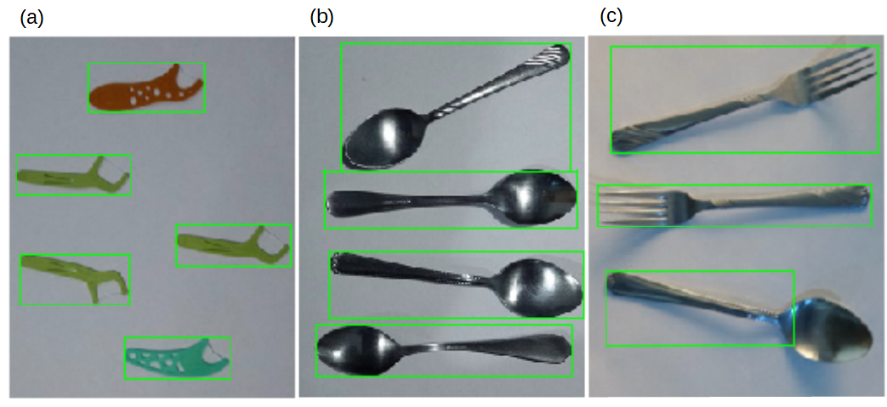
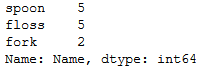

***

#### Table of contents <br>  

Abstract    
1. Problem Statement      
2. Overview of Approach and Data Preparation      
3. Machine Learning  
4. Deep Learning    
5. Transfer Learning  
6. Object Detection and Object Recognition  
7. Summary and Future Works      

**Appendix A. Data Preparation**<br>
**Appendix B. Machine Learning Model**<br>
**AppendiX C. NN and CNN Models**<br>
**Appendix D. Pre-trained Model: Visual Geometry Group-16 (VGG-16)** <br>
**Appendix E. Object Detection and Object Recognition** <br>
**Appendix F. Dependent Files**<br>

***
<br>

Abstract <br>   
Without a robust inventory management system in place, it is easy for items to be misplaced, mislabeled, or even stolen. This, in turns, will result in financial losses in a business. I propose to use machine learning and deep learning models to automate and eliminate errors in keeping track of inventory. The proposed system requires two main components to be developed, object detection and object recognition. Three approaches to object recognition are explored in this work: (1) a combination of histogram oriented gradient (HOG) and support vector machine (SVM), (2) a simple neural network (NN) and convolutional neural network (CNN), and (3) a pretrained VGG16 model. The pretrained VGG16 model yields a 100% accuracy. Using a combination of the VGG16 model with contours detection, I demonstrate that objects in an image can be automatically detected and labeled. The results are summarized into pandas DataFrame and saved as a csv file.  

<br>

#### 1. Introduction <br>  

Having an efficient and error-proof inventory management system is central to every business. Poor inventory management system will result in financial losses due to items being misplaced, mislabeled, or even stolen.     

The client is a logistic company who wish to improve their inventory management system to enhance accuracy and speed. As part of the effort, I propose a computer program that can identify objects from an image and subsequently generate a list of the identified objects to a simple csv file.   

The data is a series of images of various labeled objects. For a proof-of-concept testing of the computer program, I will be taking pictures of common household objects (e.g., boxes, kitchenwares, toys). <br>
<br>

#### 2. Overview of Approach and Data Preparation
*Overview of approach*  
To automatically label objects in an image, several machine learning models are assessed. The one that shows the best accuracy is selected. **Figure 2.1.** summarizes the overall approach, which are as follows:

- First, labeled images are acquired. 
- The images are processed.
- The image features are extracted. 
- The extracted features are fed into various models.
- The best model that shows the highest accuracy is selected.
- The selected model is combined with object detection algorithm.
- In practice, objects within an image are detected and labeled.
- Object labels and counts are finally recorded into pandas DataFrame.

<br>
**Figure 2.1.** A flowchart summarizing the overall approach. 

*Overview of Datasets* <br>
To demonstrate the concept, I acquire pictures of common household objects, spoon, fork, and floss. I select these objects due to their similarities (i.e., all objects have a high aspect ratio). I wanted to asses the robustness of deep learning and machine learning models in distingushing similar objects. **Figure 2.2** shows representative images from each category. <br>

```{}
import cv2
import matplotlib.pyplot as plt

#image paths
images=["Images/spoon/spoon_2.jpg","Images/fork/fork_2.jpg", "Images/floss/floss_2.jpg"]
#image labels
label_dict_key=['1','2','3']
label_dict={'1':'(a)','2':'(b)','3':'(c)'}

for i,image in enumerate(images):
    plt.subplot(1,3,i+1)
    img=cv2.imread(image)
    plt.imshow(img)
    plt.title(label_dict[label_dict_key[i]])
    plt.axis('off') #turn off axes
plt.show()
print('Figure 2.2. (a) Spoon, (b) Fork, (c) Floss.')
```


<br>
**Figure 2.2.** (a) Spoon, (b) fork, and (c) floss.<br>

As a part of the data cleaning efforts, I resize the raw images, make sure that each one is oriented horizontally, and then augment the images. Initially, only 14 images are acquired per category. After the image augmentation, a total of 112 images per category are obtained. **Figure 2.3** shows the images that are generated by image augmentation.

<br>
**Figure 2.3.** Example of spoon images generated via image augmentation.<br>

Please refer to **Appendix A** for details.
<br>
<br>

#### 3. Machine Learning

I use a combination of histogram oriented gradient (HOG) to extract features in the images and support vector machine (SVM) to correlate each image with its labels. This is a well-known routine. Code is adapted from the book by Gabriel Garrido and Prateek Joshi [2]. Alternatively, the image features may be extracted using, e.g., scale-invariant feature transform (SIFT), speeded-up robust features (SURF), features from accelerated segment test (FAST), binary robust independent elementary features (BRIEF), and oriented FAST and rotated BRIEF (ORB).

The 336 dataset consisting of images from three categories (i.e., spoon, fork, and floss) are split into 65% training set and 35% test set. An accuracy level of 95.76%. The model is saved as Models/svm.cpickle. 

Below demonstrate the application of the model to an unlabeled image of spoon. First, let's load the image to visualize. 

```{}
#load test image
im_test=cv2.imread("Images/spoon/spoon_1.jpg")

im_test_resize=cv2.resize(im_test,(46,83))
#gray the image
im_test_resize_gray=cv2.cvtColor(im_test_resize, cv2.COLOR_BGR2GRAY)

im_test_resize_gray.shape #check

#visualize image
plt.imshow(im_test_resize_gray, cmap='gray')
plt.axis('off')
plt.show()
```

<br>
**Figure 3.1. The test image showing a picture of a spoon.**<br>

Next, transform the image numpy array into hog features. Then, feed the hog features into the model. <br>

```{}
#extract hog features
hist_test = feature.hog(im_test_resize_gray, orientations = 9,
    pixels_per_cell = (8,8),
    cells_per_block = (3,3),
    transform_sqrt = False,block_norm='L2-Hys')

hist_test=hist_test.reshape(1,hist_test.shape[0]) #reshape data 

hist_test.shape #check

#apply model
print('The object is:', load_model.predict(hist_test)[0])
```

The object is: spoon <br>

<br>  

The model correctly predicts the object in the image as a spoon. Please refer to **Appendix B** for details.
<br>
<br>

#### 4. Deep Learning

As an alternative to the HOG-SVM method, I correlate directly each image to the corresponding labels using a neural network (NN) model. I also try a more sophisticated model, convolutional neural network (CNN). The prediction accuracy for NN and CNN models are 90% and 96%, respectively. The convolutional layer in CNN is a feature extractor like HOG. At a 96% accuracy, the CNN model is in par with the HOG-SVM model. <br>


**Figure 4.1** below shows the accuracy graph of the NN model during training. Note that the accuracy levels off at 90%. <br>

(a)<br>
<br>
(b)<br>
<br>
**Figure 4.1.** Plots of: (a) model accuracy and (b) model loss corresponding to the NN model.<br>
<br>

**Figure 4.2** below shows the accuracy graph of the CNN model during training. Note that the accuracy levels off at 96%. <br>  
<br>

(a)<br>
<br>
(b)<br>
<br>
**Figure 4.2.** Plots of: (a) model accuracy and (b) model loss corresponding to the NN model.<br>  
<br>

Below demonstrates the use of the optimized CNN model for predicting object in an unlabeled image.<br>

```{}
import cv2

img=cv2.imread("Images/floss/floss_4.jpg")
img_gray=cv2.cvtColor(img, cv2.COLOR_BGR2GRAY)

img_gray=cv2.resize(img_gray,(83,46))

img_gray.shape

plt.imshow(img_gray, cmap='gray')
plt.axis('off')
plt.show()
```

<br>
**Figure 4.3.** The test image showing a picture of a floss.<br>

```{}
from keras.models import load_model
load_model = load_model('Models/cnn_weights-improvement-14-0.96.hdf5')

print('The image is a:', encoder.inverse_transform(load_model.predict(img_gray.reshape(1,46,83,1)))[0])
```

The image is a: floss  


<br>  

The model correctly predicts the object in the image as a floss. Please refer to **Appendix C** for details.<br>
<br>  

#### 5. Transfer Learning
To achieve a better accuracy than 96% (see **Appendix B** and **C**), I consider a pretrained model, visual geometry group-16 (VGG-16). The VGG-16 model is initially unable to recognize the three objects used in this study. After training, the model achieves a 100% accuracy. As a final assessment, the model is fed with randomly selected images from the internet. The model is able to label the three images accurately (see **Figure 5.1**).

<br>
**Figure 5.1.** Three randomly selected images taken from the internet labeled accurately using the trained VGG-16 model: (a) spoon, (b) fork, and (c) floss. <br>
<br>

#### 6. Object Detection and Object Recognition
Objects in an image can be labeled using a combination contours detection and the trained VGG16 model with a good accuracy. In order for the objects to be detected, the user must enter the approximate aspect ratio of the object. Contours detection performs poorly when the objects in an image has undefined contours and/or have very different aspect ratios (see **Figure 6.1**). In **Figure 6.1c**, the contours detector does not wholly detect the spoon.  

 <br>
**Figure 6.1.** Example pictures showing contours detection of various objects: (a) floss, (b) spoons, and (c) spoon and forks.  

Given a series of images, the inventory management system detects and labels objects in each image, generates a pandas DataFrame, and saves it into a csv file. Below summarizes the results for images shown in **Figure 6.1**.  

```{}
#Loop through images and append data to a single DataFrame

df_objects=pd.DataFrame() #an empty DataFrame for storing object information

for i in range(7):
    if i==0:
        df=detect_recognize_objects("Images/fin_test/test_%sa.jpg" %(i+1), 0.2,0.02)
        df_objects=pd.concat([df_objects,df], axis=1, ignore_index=True)
        
    else:
        df=detect_recognize_objects("Images/fin_test/test_%sa.jpg" %(i+1), 0.5,0.05)
        df_objects=pd.concat([df_objects,df], axis=1, ignore_index=True)

df_objects=df_objects.T
df_objects.columns=["Name", "Probability", "Image_array"] #rename columns
#df_objects #check

#sort by names
df_objects.sort_values(["Name"])
```

The above code yields the following pandas DataFrame:  

 <br>  

From the above pandas DataFrame, we can generate counts for each object:

``` {}
#count number of objects

pd.value_counts(df_objects.Name)

```

 <br>  


#### 7. Summary and Future Works  
- I demonstrate here that a combination of object detection and object recognition algorithms can be used to detect and label objects in a series of images. 
- In this work, I use contour detection algorithm for object detection and VGG16 model for object recognition.
- The training images include 14 images from each of the three categories, spoon, fork, and floss. 
- To increase the number of dataset from 14 to 112, I use image augmentation.  
- As part of the data preparation, the images are combined and stored as pandas DataFrame in a csv format.
- Using the generated csv file, machine learning and deep learning models are initially assessed.
- HOG/SVM and CNN model yield an accuracy of 96%. A simple NN model yields an accuracy of only 90%.
- The CNN model may be further optimized using the built-in GridSearchCV class in scikitlearn, but it is not explored in this work. Some parameters that may be varied include the dropout rate, learning rate, and number of epochs. During the epoch runs, ModelCheckpoint can be used (as demonstrated in **Appendix C**) to select weights that give the best accuracy. 
- Instead, I have considered an even more sophisticated model than CNN (i.e., a pretrained VGG16 model). An accuracy of 100% is achieved using the trained VGG16 model.
- Future work may include object detection/object recognition froma real-time video using a more sophisticated object detection algorithms, such as you only look once (YOLO) and single shot detection (SSD). 

<br>
<br>


**Appendix A. Data Preparation**<br>
As a part of the data preparation, labeled training images are standardized in terms of its orientation and dimensions. The number of dataset is increased by augmentation. The data is then saved into a csv file (Data/combined.csv) for later retrieval. <br>

**Appendix B. Machine Learning Model**<br>
A combination of histogram of oriented gradients (HOG) and support vector machine (SVM) is used to recognize objects. HOG is used to extract features from an image, and SVM is used to correlate the image features to the image labels. The dataset used here is the Data/combined.csv, which is generated in **Appendix A**. <br>

**AppendiX C. NN and CNN Models**<br> 
Here, the image datasets generated in **Appendix A** (Data/combined.csv) are fitted to a simple neural network (NN) model, as well as to a more sophisticated convolutional neural network (CNN) model. <br>

**Appendix D. Pre-trained Model: Visual Geometry Group (VGG)**<br>
Initial assessment of the well-known pre-trained visualgeometry group (VGG16) model shows that it poorly predicts the three objects that are studied in this project (i.e., spoon, fork, and floss). The number 16 means that it consists of 16 weight layers [1]. This justifies the need to custom-train this model. Due to the more complex architecture than the models that are dicussed in **Appendix B** and **C**, the trained VGG16 model achieves a better accuracy than HOG/SVM, NN, or CNN. 

**Appendix E. Object Detection** <br>
In **Appendix A**, **B**, and **C**, I have assessed the accuracy of a number of models for predicting household objects that belong to three categories (i.e., spoon, fork, and floss). The pre-trained VGG16 model outperforms the other three models (i.e., HOG/SVM, NN, and CNN). Thus, I use the VGG16 model for the final portion of this project.

In this section, unlabeled objects are discerned via contour detection and then identified using te selected VGG16 model.   

**Appendix F. Dependent Files**<br>

- Data folder <br>
  -spoon.csv  
  -fork.csv  
  -floss.csv  
  -combined.csv
  -combined_rgb.csv
  
  Due to the large size (>100 MB), combined_rgb.csv is not included in this Github  
  repository.
  
- Figures folder <br>
  -Fig2-1_Flowchart.png  
  -Fig2-2_labeled_objects.png  
  -Fig2-3_image_augmentation.png  
  -Fig3-1_Spoon.png  
  -Fig4-1a_NN_model_accuracy.png  
  -Fig4-1b_NN_model_loss.png  
  -Fig4-2a_NN_model_accuracy.png  
  -Fig4-2b_NN_model_loss.png  
  -Fig4-3_Floss.png  
  -Fig5-1_VGG16_test.png  
  -Fig6-1_Test_images.png  
  -Fig6-2_DataFrame.png  
  -Fig6-3_pd_DataFrame_counts.png  

- Images folder <br>
  -floss_test.jpg  
  -fork_test.jpg 
  -spoon_test.jpg  
  -test_1a.jpg  
  -test_2a.jpg  
  -test_3a.jpg  
  
  Due to the large file size (>100 MB), the original jpg training images and the first three jpg    images listed above are not included in this Github repository. <br>
  
- Model folder <br>
  Due to the large files size, this folder is not included in this Github repository. All     files are saved in hdf5 format. The names of these files are as follows: <br>
  
  -svm.cpickle    
  -nn_weights-improvement-05-0.90.hdf5  
  -cnn_weights-improvement-14-0.96.hdf5  
  -vgg_weights-improvement-06-1.00.hdf5  
