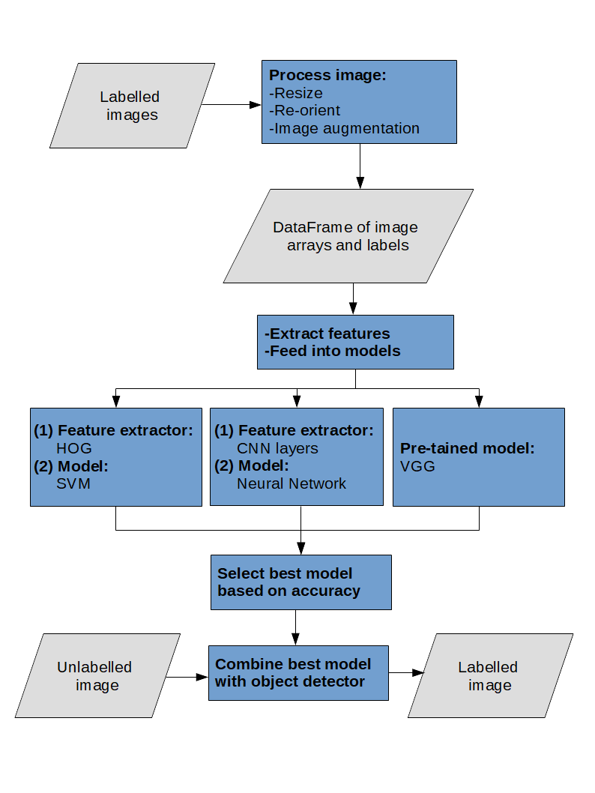
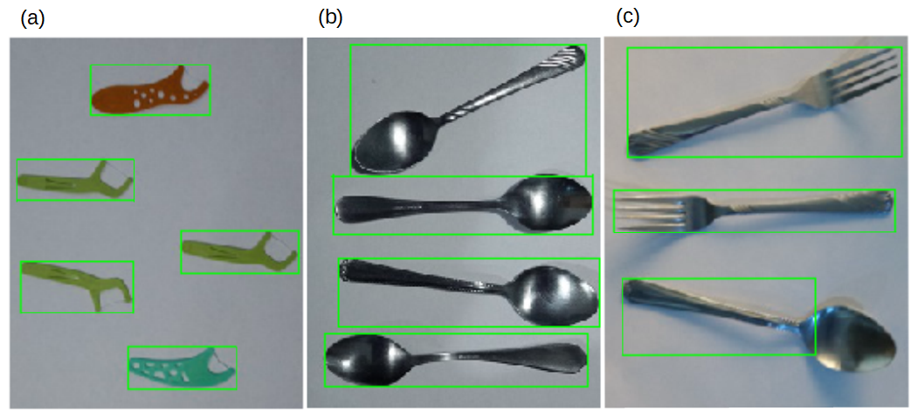
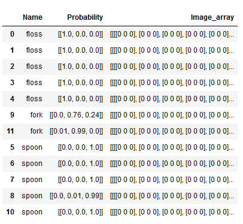
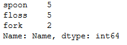

An Automated Inventory Management System via a Machine Learning Approach
========================================================
author: Ray Gunawidjaja
date: May 5th, 2018
autosize: true

Presentation Outline 
========================================================
 
1. Problem Statement  
2. Overview of Approach  
3. Data Preparation   
4. Machine Learning and Deep Learning Models  
5. Object Detection and Object Recognition  
6. Summary and Future Works  

1. Problem Statement
========================================================
 
### Problem   
Poor inventory management system results in financial losses due to items being misplaced, mislabeled, or even stolen.     
 

### Proposed solution  
I propose a computer program that can identify objects from an image and subsequently generate a list of the identified objects to a simple csv file.   

2. Overview of Approach       
========================================================

 
- Process labeled images     
 
- Develop a model    
 
- Feed processed images into various models     
 
- Select the best model  
 
- Combine the selected model with object detection     
 
- Detect and label objects, enter information into pandas DataFrame and save as csv.    
 

3 Data Preparation
========================================================
3.1. The Dataset

- The dataset is pictures of common household objects: ( a ) spoon, ( b ) fork, and ( c ) floss.  
 
 
- All objects have a high aspect ratio.  
 
- To asses the robustness of deep learning and machine learning models in distingushing similar objects.  

3 Data Preparation
========================================================
3.2. Data Processing
- Make sure that every image is horizontally oriented  
- Augment images using the built-in ImageDataGenerator class in keras. Increased number of images from 14 to 112.  
- Resize images to 58x103 for VGG16 model  
- Transform images to gray and resize to 46x83 for HOG/SVM, NN, and CNN models.
- Images are saved as pandas DataFrame into a csv file, rather than as images.

4. Machine Learning and Deep Learning Models 
========================================================
The following models are considered:  
- A combination of histogram oriented gradient (HOG) and support vector machine (SVM)  
- Neural Network  
- Convolutional Neural Network  
- Pre-trained visual geometry group-16 (VGG-16)  

4.1. Machine learning [2]
========================================================
- Use a combination of histogram oriented gradient (HOG) and support vector machine (SVM). 
- HOG extracts features from an image.   
- SVM correlated image labels with image features.  
- Other common alternatives to HOG are scale invariant feature transform (SIFT) and speeded up robust features (SURF).  
- SIFT and SURF, however, cannot be used for commercial solutions because they are patented [1].  

4.2. Deep Learning [3]    
========================================================
- For the deep learning model, a baseline neural network (NN) model and a convolutional neural network (CNN) model are assessed.  
- The baseline NN model consists of just an input and an output layer.  
- The CNN model consists of the following: a convolutional layer, a pooling layer, a hidden layer, and an output layer. 
- For the CNN model, the convolutional layer is a feature extractor. The NN model uses every data point as input parameters.  

4.3. Transfer Learning [4]  
========================================================
- As an alternative, I assess a pre-trained VGG-16 model, which is a sophisticated CNN model.  
- Initial assessment of the pretrained VGG-16 model shows that it is unable to recognize any of the three objects (i.e., spoon, fork,and floss). The initial results are as follows:  

|Predicted label (prob.)| Actual label |
|:------:|:-----:|
|envelope (14.83%) | floss|
|spatula (59.51%) | fork |
| hook (23.42%) | spoon |
- This justifies the need to custom-train the model. 

4.4. Accuracy of the different models
========================================================
- The accuracy of the different models after training are as follows:  

| Models | Accuracy (%) | 
|:------:|:-----:|
| HOG/SVM | 96 |
| NN | 90 |
| CNN | 96 |
| VGG-16 | 100 |

- VGG-16 model is 100% accurate. Hence, it is selected.

5. Object Detection and Object Recognition  
========================================================
- Contour detection algorithm is used for object detection.  
- The trained VGG-16 model is used for onject recognition.   
- The three images below are used for proof-of-concept of this automated inventory management system.  
  
- Note that in figure ( c ), the contour detection algorithm does not fully detect the spoon.  

5. Object Detection and Object Recognition Cont...
========================================================
- Having detected and recognized objects in a series of images, the program enters the information into a pandas DataFrame, as follows:  

- The DataFrame consists of three columns: predicted object name, probability, and image array.  
- Using data in the 3rd column, each image can be re-constructed and verified with the predicted label.  

5. Object Detection and Object Recognition Cont...
========================================================
- Finally, the DataFrame can be analyzed to yield the number of objects per category, as follows:  
 

6. Summary and Future Works  
========================================================
- A combination of object detection and object recognition algorithms can be used to detect and label objects in a series of images.   
- The training images include 14 images from each of the three categories, spoon, fork, and floss.   
- To increase the number of dataset from 14 to 112, I use image augmentation.  
- VGG-16 model is used for object recognition. An accuracy of 100% is achieved using the trained VGG16 model.  
- Contour detection algorithm is used for object detection. Contour detection algorithm does not work well for an image that contain objects that have different aspect ratios or have undefined edge-contrast.  
- Future work may include object detection/object recognition from a real-time video using a more sophisticated object detection algorithms, such as you only look once (YOLO) and single shot detection (SSD).  

7. References
========================================================
 
1. https://docs.opencv.org/2.4/modules/nonfree/doc/nonfree.html  
2. Gabriel Garrido and Prateek Joshi, "OpenCV 3.x with Python By Example", Packt, 2018, Chpt. 9.  
3. Jason Brownlee, "Deep Learning with Python", Machine Learning Mastery, 2018.  
4. https://machinelearningmastery.com/use-pre-trained-vgg-model-classify-objects-photographs/  

