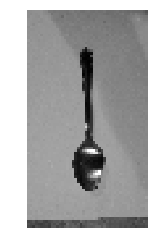
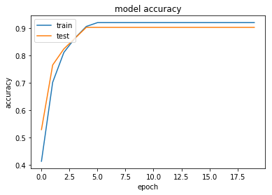
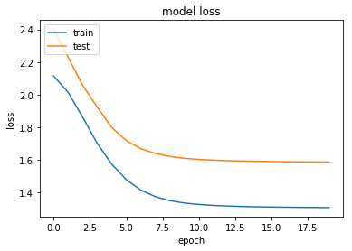
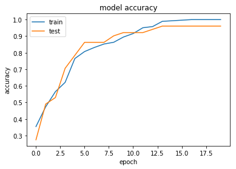
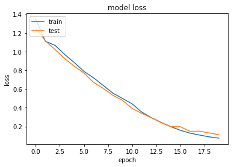
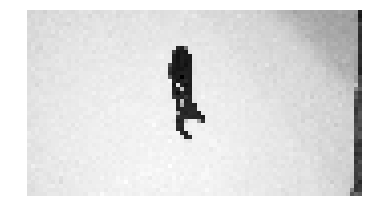

```{r setup, include=FALSE}
knitr::opts_chunk$set(echo = TRUE)
```

***

#### Table of contents <br>  

**Abstract**  

1. Problem Statement      
2. Overview of Approach and Data Preparation      
3. Machine Learning  
4. Deep Learning    
5. Summary and Next Steps    

**Appendix A. Data Preparation**<br>
**Appendix B. Machine Learning Model**<br>
**AppendiX C. NN and CNN Models**<br> 
**Appendix D. Dependent Files**<br>

***
<br>

**Abstract** <br>   
Without a robust inventory management system in place, it is easy for items to be misplaced, mislabeled, stolen, etc. This, in turns, will result in financial losses in a business. I propose to use machine learning and deep learning models to automate and eliminate error in keeping track of inventory. Three approaches are explored in this work: (1) a combination of histogram oriented gradient (HOG) and support vector machine, (2) a simple neural network and convolutional neural network, and (3) a pretrained VGG model. The codes that I use are adapted from various references that are cited herein. All three approaches involve two major steps: (1) distinct features are extracted from labeled image (i.e., extraction) and (2) the distinct features are correlated to the assigned labels. The model with the best accuracy is selected and combined with an object detection algorithm. Finally, using the combination of an object recognition and an object detection algorithm, we can label and count objects in a picture. The VGG model and the final step will be presented in the upcoming final report.        

<br>

#### 1. Introduction <br>  

**Problem statement **<br>
*What is the problem you want to solve?*<br>
Having an efficient and error-proof inventory management system is central to every business. Poor inventory management system will result in financial losses due to items being misplaced, mislabeled, stolen, etc.   

**How does it benefit the client**<br>
*Who is your client and why do they care about this problem? What will your client DO or DECIDE based on your analysis that they would not have otherwise?*<br>
The client is a logistic company who wish to improve their inventory management system to enhance accuracy and speed. As part of the effort, I propose a computer program that can identify objects from a livestream video and subsequently generate a list of the identified objects to a simple csv file. The list will be used as a new inventory list, for inventory reconciliation, or for further analysis. 

**Data source** <br>
*What data are you going to use for this? How will you acquire the data?*<br>
The data is a series of images of various labeled objects. For a proof-of-concept testing of the computer program, I will be taking pictures of common household objects (e.g., boxes, kitchenwares, toys). <br>
<br>

#### 2. Overview of Approach and Data Preparation
*Overview of approach*
To automatically label objects in an image, several machine learning models will be assessed. The one that shows the best accuracy will be selected. **Figure 2.1.** summarizes the overall approach, which are as follows:

- First, labeled images are acquired. 
- The images are processed.
- The image features are extracted. 
- The extracted features are fed into various models.
- The best model that shows the highest accuracy is selected.
- The selected model is combined with object detection algorithm.
- In practice, objects within an image are detected and labeled.
- Object labels and counts are finally recorded into pandas DataFrame.

<br>
**Figure 2.1.** A flowchart summarizing the overall approach. 

*Overview of Datasets* <br>
Three set of images are acquired, spoon, fork, and floss. **Figure 2.2** shows representative images from each category. <br>

```{}
import cv2
import matplotlib.pyplot as plt

#image paths
images=["Images/spoon/spoon_2.jpg","Images/fork/fork_2.jpg", "Images/floss/floss_2.jpg"]
#image labels
label_dict_key=['1','2','3']
label_dict={'1':'(a)','2':'(b)','3':'(c)'}

for i,image in enumerate(images):
    plt.subplot(1,3,i+1)
    img=cv2.imread(image)
    plt.imshow(img)
    plt.title(label_dict[label_dict_key[i]])
    plt.axis('off') #turn off axes
plt.show()
print('Figure 2.2. (a) Spoon, (b) Fork, (c) Floss.')
```


<br>
**Figure 2.2.** (a) Spoon, (b) fork, and (c) floss.<br>

Images are resized, made sure that each one is oriented horizontally, and then augmented.Initially, only 14 images are acquired per category. After the image augmentation, a total of 112 images per category are obtained. **Figure 2.3** shows the images that are generated by image augmentation.

<br>
**Figure 2.3.** Example of spoon images generated via image augmentation.<br>

Please refer to **Appendix A** for details.
<br>
<br>

#### 3. Machine Learning

I use a combination of histogram oriented gradient (HOG) to extract features in the images and support vector machine (SVM) to correlate each image with its labels. This is a well-known routine. Code is adapted from the book by Gabriel Garrido and Prateek Joshi [2]. Alternatively, the image features may be extracted using, e.g., scale-invariant feature transform (SIFT), speeded-up robust features (SURF), features from accelerated segment test (FAST), binary robust independent elementary features (BRIEF), and oriented FAST and rotated BRIEF (ORB).

The 336 dataset consisting of images from three categories (i.e., spoon, fork, and floss) are split into 65% training set and 35% test set. An accuracy level of 95.76%. The model is saved as Models/svm.cpickle. 

Below demonstrate the application of the model to an unlabeled image of spoon. First, let's load the image to visualize. 

```{}
#load test image
im_test=cv2.imread("Images/spoon/spoon_1.jpg")

im_test_resize=cv2.resize(im_test,(46,83))
#gray the image
im_test_resize_gray=cv2.cvtColor(im_test_resize, cv2.COLOR_BGR2GRAY)

im_test_resize_gray.shape #check

#visualize image
plt.imshow(im_test_resize_gray, cmap='gray')
plt.axis('off')
plt.show()
```

<br>
**Figure 3.1. The test image showing a picture of a spoon.**<br>

Next, transform the image numpy array into hog features. Then, feed the hog features into the model. <br>

```{}
#extract hog features
hist_test = feature.hog(im_test_resize_gray, orientations = 9,
    pixels_per_cell = (8,8),
    cells_per_block = (3,3),
    transform_sqrt = False,block_norm='L2-Hys')

hist_test=hist_test.reshape(1,hist_test.shape[0]) #reshape data 

hist_test.shape #check

#apply model
print('The object is:', load_model.predict(hist_test)[0])
```

The object is: spoon <br>

The model correctly predicts the object in the image as a spoon. Please refer to **Appendix B** for details.
<br>
<br>

#### 4. Deep Learning

As an alternative to the HOG-SVM method, I correlate directly each image to its labels using a neural network (NN) model. I also try a more sophisticated model, convolutional neural network (CNN). The prediction accuracy for NN and CNN models are 90% and 96%, respectively. The convolutional layer in CNN is a feature extractor like HOG. At a 96% accuracy, the CNN model is in par with the HOG-SVM model. <br>


**Figure 4.1** below shows the accuracy graph of the NN model during training. Note that the accuracy levels off at 90%. <br>


<br>
**Figure 4.1.** Plots of: (a) model accuracy and (b) model loss corresponding to the NN model.
<br>

**Figure 4.2** below shows the accuracy graph of the CNN model during training. Note that the accuracy levels off at 96%. <br>


<br>
**Figure 4.2.** Plots of: (a) model accuracy and (b) model loss corresponding to the NN model.
<br>

Below demonstrates the use of the optimized CNN model for predicting object in an unlabeled image.

```{}
import cv2

img=cv2.imread("Images/floss/floss_4.jpg")
img_gray=cv2.cvtColor(img, cv2.COLOR_BGR2GRAY)

img_gray=cv2.resize(img_gray,(83,46))

img_gray.shape

plt.imshow(img_gray, cmap='gray')
plt.axis('off')
plt.show()
```

<br>
**Figure 3.2.** The test image showing a picture of a floss.<br>

```{}
from keras.models import load_model
load_model = load_model('Models/cnn_weights-improvement-14-0.96.hdf5')

print('The image is a:', encoder.inverse_transform(load_model.predict(img_gray.reshape(1,46,83,1)))[0])
```

The image is a: floss  

Please refer to **Appendix C** for details.<br>
<br>  


#### 5. Summary and Next Steps
- The training dataset is provided as labeled images.
- To increase the number of dataset, I use image augmentation.  
- A csv file containing labeled image dataset is generated from training dataset provided by user.
- Using the generated csv file, machine learning and deep learning models are generated.
- The machine learning model is implemented by extracting image features using HOG and correlating the features to labels using support vector machine (SVM) model.
- A simple NN model is assessed.
- A more sophistocated NN model extracts image features using a convolutional layer and correlates the image features to labels using a neural network (NN) model. This is known as a convolutional neural network (CNN) model.
- The generated models with the highest accuracy are saved into files.
- The accuracy of CNN is in par with HOG-SVM.
- Next, I will consider an even more sophistocated  model than CNN (i.e., a pretrained model).
- I will then combine the pretrained CNN model with object detection to label objects in an arbitrary image.
<br>
<br>


**Appendix A. Data Preparation**<br>
As a part of the data preparation, labeled training images are standardized in terms of its orientation and dimensions. The number of dataset is increased by augmentation. The data is then saved into a csv file for later retrieval. <br>

**Appendix B. Machine Learning Model**<br>
A combination of histogram of oriented gradients (HOG) and support vector machine (SVM) is used to recognize objects. HOG is used to extract features from an image, and SVM is used to correlate the image features to the image labels. The dataset used here is the Data/combined.csv, which is generated in **Appendix A**. <br>

**AppendiX C. NN and CNN Models**<br> 
Here, the image datasets generated in **Appendix A** (Data/combined.csv) are fitted to a simple neural network (NN) model, as well as to a more sophisticated convolutional neural network (CNN) model. <br>


**Appendix D. Dependent Files**<br>

- Data folder <br>

  -spoon.csv  
  -fork.csv  
  -floss.csv  
  -combined.csv  
  
- Figures folder <br>
  -Fig2-1_Flowchart  
  -Fig2-2_labeled_objects  
  -Fig2-3_image_augmentation  
  -Fig3-1_Spoon  
  -Fig4-1a_NN_model_accuracy  
  -Fig4-1b_NN_model_loss  
  -Fig4-2a_NN_model_accuracy  
  -Fig4-2b_NN_model_loss  
  -Fig4-3_Floss  

- Images folder <br>
  Due to the large files size, this folder is not included in this Github repository. All     files are saved in jpg format. <br>
  
- Model folder <br>
  Due to the large files size, this folder is not included in this Github repository. All     files are saved in hdf5 format <br>
